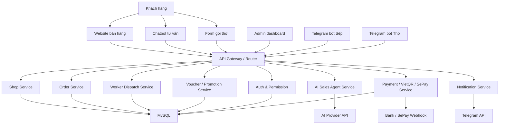
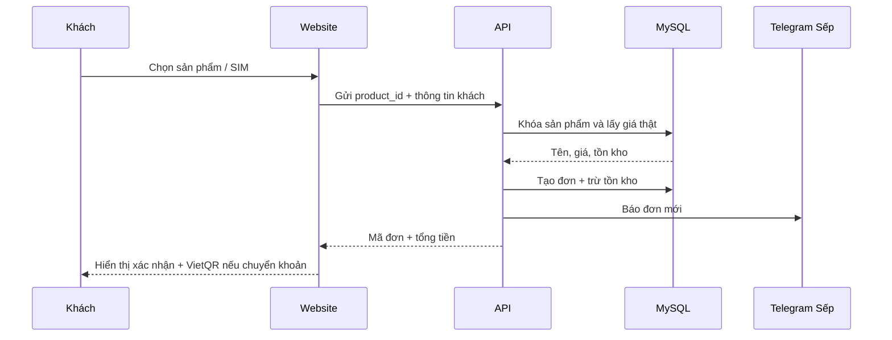
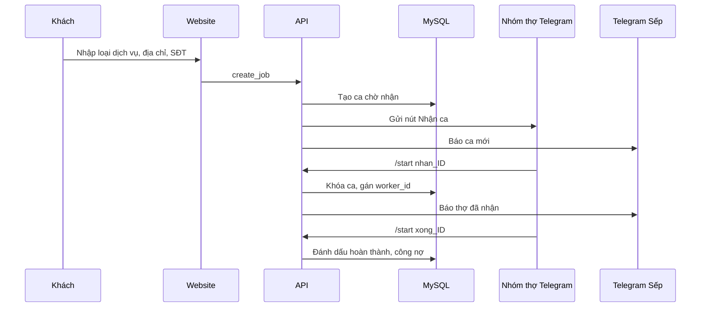
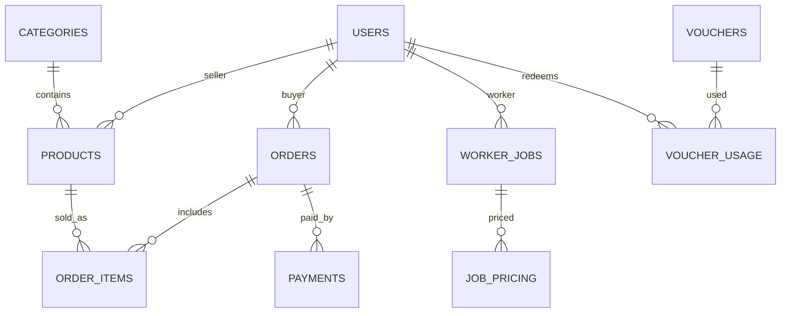
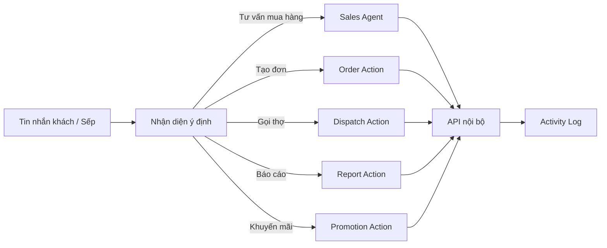

# Rà Soát Và Bản Vẽ Dự Án Điện Tử Hiếu

Ngày rà soát: 2026-06-03

## 1. Kết Luận Nhanh

Dự án hiện đã có bản chạy dạng PHP thuần gồm trang bán hàng, API tổng, admin, gọi thợ, vòng quay may mắn, chatbot AI và Telegram bot. Tuy nhiên đây chưa phải một bộ mã nguồn chuẩn để mở rộng lâu dài. Mã đang là dạng monolithic: `index.php`, `api_master.php`, `admin_xxx.php` ôm quá nhiều việc, trong khi các thư mục kiến trúc sạch như `app/Controllers`, `app/Models`, `app/Services`, `routes`, `tests` gần như mới là khung trống.

Ưu tiên đúng là giữ hệ thống đang chạy, siết bảo mật, thống nhất database, rồi mới tách dần thành các module chuẩn.

## 2. Hiện Trạng Đã Rà

- Tổng quan thư mục: 41 file, khoảng 16 MB dữ liệu.
- File chính đang vận hành: `index.php`, `api_master.php`, `admin_xxx.php`.
- Database có 2 hướng song song: `database/schema.sql` theo mô hình marketplace sạch, và `api_master.php` tự tạo bảng legacy như `products`, `orders`, `job_posts`, `marketplace_sims`.
- Thư mục `app/`, `controllers/`, `routes/`, `tests/` đã có ý định kiến trúc tốt nhưng chưa có code thực tế.
- `src/data/products.js` và `src/screens/ProductScreen.js` đang rỗng, chưa phải frontend React hoàn chỉnh.
- `.env`, log, upload, cấu hình SFTP đang nằm trong workspace, cần chặn không đưa lên Git.

## 3. Phân Loại Sai Sót

### 3.1. Nhóm Đỏ: Bảo Mật

- API từng hard-code database, Telegram token, AI key và mật khẩu admin trong `api_master.php`.
- Admin từng dùng mật khẩu cố định và cookie tĩnh dễ đoán.
- Các endpoint admin có thể bị gọi trực tiếp nếu biết URL API.
- Webhook Telegram chưa có secret xác thực.
- Tài liệu hướng dẫn từng chứa API key mẫu dạng thật.
- `.vscode/sftp.json`, `.env`, log không được để vào mã nguồn.

### 3.2. Nhóm Cam: Kiến Trúc

- `api_master.php` là "god-file", vừa database, vừa Telegram, vừa admin API, vừa chatbot.
- `index.php` chứa HTML, CSS, JS, cấu hình ngân hàng và logic đặt hàng trong một file.
- `admin_xxx.php` chứa UI, auth và JavaScript admin trong một file.
- Các thư mục clean architecture đã tạo nhưng chưa được nối vào runtime.
- Chưa có router chính thức, chưa có service layer, repository/model rõ ràng.

### 3.3. Nhóm Cam: Database

- Có 2 schema cạnh tranh: legacy và marketplace v3.
- Bảng `orders` trong API cũ khác hẳn bảng `orders` trong `database/schema.sql`.
- `products` khác `marketplace_products`; `marketplace_sims` khác `sims`.
- Migration đang nhắc tới bảng cũ như `kho_sim`, `cuoc_xe`, `tai_xe`, nhưng workspace hiện không có dữ liệu chứng minh các bảng đó đã tồn tại.
- Tên biến `.env` dễ gây nhầm giữa database name và database user, cần chuẩn hóa lại trên server thật.

### 3.4. Nhóm Vàng: Lỗi Chức Năng

- Admin gửi JSON nhưng API đọc `$_POST`, làm xóa sản phẩm/tạo voucher/tạo QR dễ fail.
- Admin in hóa đơn gọi biến ngân hàng chưa khai báo.
- Admin chỉ liệt kê đơn `status != 'new'`, trong khi đơn mới là thứ cần xử lý trước.
- Chatbot ghi lead không có `product_id`, có thể fail nếu MySQL strict.
- Đặt hàng từng tin giá gửi từ trình duyệt, dễ bị sửa giá phía client.
- API lưu voucher vòng quay thiếu giới hạn, dễ bị spam.

### 3.5. Nhóm Xám: Vận Hành

- Chưa có test tự động.
- Chưa có script deploy rõ ràng.
- Chưa có health check tách khỏi database.
- Chưa có quy trình rotate token/API key sau khi lộ.
- Log đang báo bảng `users` chưa tồn tại trong một hướng kiến trúc mới.

## 4. Các Điều Chỉnh Đã Làm Trong Lượt Này

- Thêm `config/bootstrap.php` để đọc `.env`, quản lý session admin, đọc JSON/form thống nhất.
- Chuyển `api_master.php` sang đọc cấu hình từ `.env`, không giữ secret trong file PHP.
- Bật kiểm tra SSL khi gọi Telegram.
- Thêm cơ chế bỏ qua Telegram nếu thiếu token/chat id, tránh làm sập luồng đặt hàng.
- Khóa các endpoint admin bằng session.
- Chuyển admin từ cookie tĩnh sang session.
- Sửa API đọc JSON cho các lệnh admin.
- Sửa admin khai báo VietQR từ `.env`.
- Sửa escape HTML ở frontend/admin.
- Sửa đơn hàng lấy tên/giá sản phẩm từ database thay vì tin giá client gửi lên.
- Sửa bảng `orders` legacy cho phép lead chatbot có `product_id = 0`.
- Sửa admin hiển thị cả đơn mới.
- Giới hạn dữ liệu lưu từ vòng quay voucher.
- Thêm `.gitignore`.
- Thêm `.env.example`.
- Dọn API key mẫu trong tài liệu hướng dẫn.

## 5. Bản Vẽ Kiến Trúc Chuẩn



## 6. Cấu Trúc Mã Nguồn Đề Xuất

```text
dien-tu-hieu/
  public/
    index.php
    admin.php
    assets/
    uploads/
  app/
    Core/
      Bootstrap.php
      Router.php
      Database.php
      Response.php
      Validator.php
    Middleware/
      AdminAuth.php
      RateLimit.php
      WebhookSecret.php
    Controllers/
      Web/
        ShopController.php
        ServiceController.php
      Api/
        ProductController.php
        OrderController.php
        VoucherController.php
        AdminController.php
      Telegram/
        BossBotController.php
        WorkerBotController.php
    Models/
      Product.php
      Sim.php
      Order.php
      User.php
      WorkerJob.php
      Voucher.php
    Services/
      AiSalesAgent.php
      TelegramNotifier.php
      WorkerDispatchService.php
      PaymentService.php
      InventoryService.php
      PromotionService.php
    Repositories/
      ProductRepository.php
      OrderRepository.php
      WorkerRepository.php
  database/
    migrations/
    seeds/
    schema.sql
  routes/
    web.php
    api.php
    telegram.php
  storage/
    logs/
    cache/
  tests/
    Unit/
    Feature/
  docs/
    RA_SOAT_VA_BAN_VE_DU_AN.md
  .env.example
  .gitignore
```

## 7. Luồng Đặt Hàng Chuẩn



## 8. Luồng Gọi Thợ Chuẩn



## 9. Bộ Bảng Dữ Liệu Cần Thống Nhất



Tên bảng chuẩn nên chọn một lần:

- `products` hoặc `marketplace_products`, không dùng song song lâu dài.
- `sims` hoặc gộp SIM vào `products` với `type = sim`.
- `orders` dùng chung cho hàng hóa, SIM và dịch vụ.
- `worker_jobs` tách khỏi `job_posts` tuyển dụng để tránh nhầm "tin việc làm" với "ca gọi thợ".

## 10. Thiết Kế AI Agent Tự Động Hóa

AI agent không nên tự ý thao tác database trực tiếp. AI nên đi qua các tool/action có quyền rõ ràng:



Các action nên có quyền:

- `order.create`: tạo đơn hàng sau khi xác nhận số điện thoại.
- `job.create`: tạo ca gọi thợ.
- `product.search`: tra sản phẩm/SIM.
- `voucher.create`: chỉ admin/Sếp được tạo mã.
- `report.daily`: gửi báo cáo doanh thu/công nợ.
- `inventory.update`: chỉ admin được sửa tồn kho.

## 11. Telegram Bot Điều Khiển Kinh Doanh

Bot Sếp nên có lệnh:

- `/baocao`: doanh thu hôm nay, đơn mới, ca thợ, công nợ.
- `/donmoi`: danh sách đơn mới cần gọi xác nhận.
- `/ca`: ca gọi thợ đang chờ.
- `/no`: công nợ nền tảng/thợ.
- `/sp <từ khóa>`: tìm sản phẩm nhanh.
- `/voucher 10 5`: tạo 5 voucher giảm 10%.

Bot Thợ nên có lệnh:

- `/start nhan_ID`: nhận ca.
- `/start xong_ID`: báo hoàn thành.
- `/ca`: xem ca đang làm.
- `/lichsu`: xem lịch sử ca.

## 12. Lộ Trình Hoàn Thiện

### Giai Đoạn 1: Chốt Nền Móng

- Rotate toàn bộ token/API key đã từng nằm trong code hoặc tài liệu.
- Điền `WORKER_CHAT_ID`, `BOSS_CHAT_ID`, `GEMINI_API_KEY`, `TELEGRAM_WEBHOOK_SECRET`.
- Chọn database chính và chạy một schema thống nhất.
- Test lại đặt hàng, gọi thợ, chatbot, admin.

### Giai Đoạn 2: Tách Module

- Tách `api_master.php` thành router + controller + service.
- Tách `index.php` thành view + asset CSS/JS.
- Tách `admin_xxx.php` thành admin view + admin API.
- Thêm `ActivityLog` cho mọi thao tác admin/AI/bot.

### Giai Đoạn 3: Chuẩn Hóa Dữ Liệu

- Gộp sản phẩm điện máy, điện thoại, phụ kiện, SIM về một mô hình catalog.
- Thiết kế đơn hàng chung cho product/sim/service.
- Thêm payment table để kết nối SePay/VietQR.
- Thêm bảng `ai_conversations` và `ai_leads`.

### Giai Đoạn 4: Kiểm Soát Vận Hành

- Thêm rate limit cho chatbot, đặt hàng, vòng quay.
- Thêm admin permission thay vì chỉ một mật khẩu.
- Thêm backup database.
- Thêm cron báo cáo ngày và nhắc công nợ có secret riêng.

### Giai Đoạn 5: Tự Động Hóa Bằng AI Agent

- AI tư vấn sản phẩm dựa trên catalog thật.
- AI tạo lead nhưng phải xin xác nhận trước khi chốt đơn.
- AI điều phối ca thợ theo khu vực/kỹ năng/lịch rảnh.
- AI gửi báo cáo cho Sếp qua Telegram.
- AI đề xuất nhập hàng/khuyến mãi từ dữ liệu bán hàng.

## 13. Checklist Nghiệm Thu Dự Án Đúng

- Trang chủ tải danh mục và sản phẩm không lỗi.
- Tìm kiếm/lọc giá/lọc SIM hoạt động.
- Đặt hàng không cho sửa giá từ trình duyệt.
- Đơn mới xuất hiện trong admin ngay.
- Admin không gọi API được nếu chưa đăng nhập.
- Tạo/xóa/sửa sản phẩm trong admin chạy đúng.
- Tạo voucher/QR trong admin chạy đúng.
- Chatbot có API key thì trả lời, không có key thì fallback tử tế.
- Gọi thợ tạo ca mới và báo Telegram.
- Thợ nhận ca không bị trùng nhờ khóa transaction.
- Webhook Telegram có secret trước khi đưa production.
- `.env`, log, upload, cấu hình SFTP không nằm trong Git.
- Có ít nhất test cho đặt hàng, gọi thợ, admin auth, voucher.

## 14. Ghi Chú Quan Trọng

Các token/API key từng xuất hiện trong code hoặc tài liệu phải được xem là đã lộ. Việc chuyển chúng sang `.env` giúp mã nguồn sạch hơn, nhưng không làm các key cũ an toàn trở lại. Cần tạo key/token mới trên Telegram, Gemini/AI provider, SePay và cập nhật lại `.env`.
