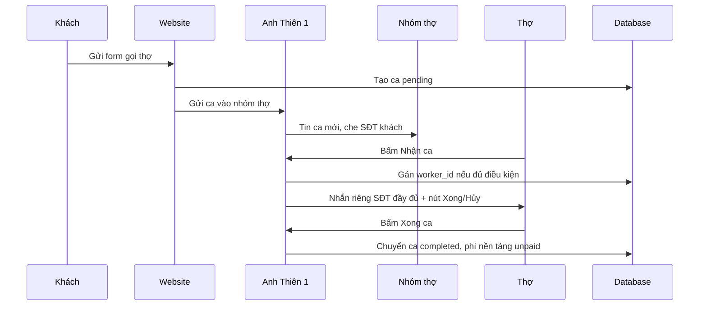

# Vận Hành Telegram Bot Điện Tử Hiếu

Ngày cập nhật: 2026-06-03

## 1. Vai Trò Bot

- Anh Thiên 1: điều phối gọi thợ điện lạnh.
  - Nhận yêu cầu từ website.
  - Báo ca vào nhóm thợ điện lạnh.
  - Cho thợ bấm nhận ca hoặc báo spam.
  - Nhắn riêng số điện thoại đầy đủ cho thợ đã nhận ca.
  - Ghi nhận xong ca, hủy ca và lý do hủy.
  - Báo phí nền tảng cho thợ vào 06:00 thứ 2.
  - Khóa nhận ca từ 00:00 thứ 3 nếu thợ chưa thanh toán phí nền tảng.

- Anh Thiên 2: báo cáo kinh doanh.
  - Gửi báo cáo doanh thu bán hàng + gọi thợ lúc 23:59 mỗi ngày.
  - Có thể dùng lệnh `/baocao` để xem nhanh.

## 2. Luồng Gọi Thợ



## 3. Luồng Hủy Ca

- Thợ bấm `Hủy ca`.
- Bot yêu cầu nhập lý do trong tin nhắn riêng.
- Sau khi thợ nhập lý do:
  - Ca mở lại cho thợ khác nhận.
  - Hệ thống tăng số lần hủy trong ngày của thợ đó.
  - Từ lần hủy thứ 3 trong ngày: bot nhắc nhở và theo dõi.
  - Đến lần hủy thứ 10 trong ngày: khóa nhận ca đến hết ngày.
  - Qua ngày mới: bộ đếm hủy trong ngày tự reset.

## 4. Điều Kiện Nhận Ca

Thợ không nhận được ca nếu:

- Bị khóa do hủy quá nhiều ca trong ngày.
- Bị khóa vì chưa thanh toán phí nền tảng sau 00:00 thứ 3.
- Chưa từng mở chat riêng với Anh Thiên 1. Bot Telegram không thể tự nhắn riêng cho người chưa bấm `/start`.

## 5. Chạy Thử Báo Ca

Trong admin, vào mục `Công việc`, bấm `Gửi ca test bot`.

Luồng test:

- Anh Thiên 1 gửi ca test vào nhóm thợ điện lạnh.
- Thợ bấm `Nhận ca`.
- Bot nhắn riêng số điện thoại đầy đủ cho thợ.
- Thợ bấm `Xong ca`.
- Hệ thống chuyển ca sang hoàn thành và ghi nợ phí nền tảng cho thợ.

Công thức mặc định:

- Khách trả: 100%.
- Phí nền tảng: 15% tiền ca.
- Thợ nhận: 85% tiền ca.
- Công nợ phí nền tảng chỉ tính khi ca đã `completed`.

## 6. Webhook Cần Cấu Hình

Nên đặt `TELEGRAM_WEBHOOK_SECRET` trong `.env`, sau đó set webhook bằng Telegram API.

Anh Thiên 1:

```bash
curl -X POST "https://api.telegram.org/bot<ANH_THIEN_1_TOKEN>/setWebhook" \
  -d "url=https://dienmayhieu.com/api_master.php?action=telegram_webhook&bot=1" \
  -d "secret_token=<TELEGRAM_WEBHOOK_SECRET>"
```

Anh Thiên 2:

```bash
curl -X POST "https://api.telegram.org/bot<ANH_THIEN_2_TOKEN>/setWebhook" \
  -d "url=https://dienmayhieu.com/api_master.php?action=telegram_webhook&bot=2" \
  -d "secret_token=<TELEGRAM_WEBHOOK_SECRET>"
```

## 7. Cron Cần Cài Trên Hosting

Nên đặt `CRON_SECRET` trong `.env`, rồi dùng secret đó trong URL cron.

06:00 thứ 2 hằng tuần, báo phí nền tảng cho thợ:

```cron
0 6 * * 1 curl -s "https://dienmayhieu.com/api_master.php?action=cron_worker_fee_notice&secret=<CRON_SECRET>"
```

00:00 thứ 3 hằng tuần, khóa thợ chưa thanh toán:

```cron
0 0 * * 2 curl -s "https://dienmayhieu.com/api_master.php?action=cron_worker_fee_lock&secret=<CRON_SECRET>"
```

23:59 hằng ngày, gửi báo cáo tổng hợp bằng Anh Thiên 2:

```cron
59 23 * * * curl -s "https://dienmayhieu.com/api_master.php?action=cron_baocao_ngay&secret=<CRON_SECRET>"
```

## 8. Mở Khóa Khi Thợ Đã Thanh Toán

Trong admin, vào mục `Thợ`, dòng nào còn `Phí chưa TT` thì bấm `Đã TT`.

Hệ thống sẽ:

- Đánh dấu các phí nền tảng chưa thanh toán của thợ đó thành `paid`.
- Gỡ khóa nhận ca do công nợ.
- Nhắn riêng cho thợ biết đã được mở lại.

## 9. Lưu Ý Bảo Mật

- Không đưa token bot vào Git.
- Không gửi token qua ảnh chụp màn hình hoặc tài liệu.
- Nếu token đã từng xuất hiện trong chat/code/tài liệu, nên tạo token mới bằng BotFather.
- `TELEGRAM_WEBHOOK_SECRET` và `CRON_SECRET` nên là chuỗi dài, khó đoán.
